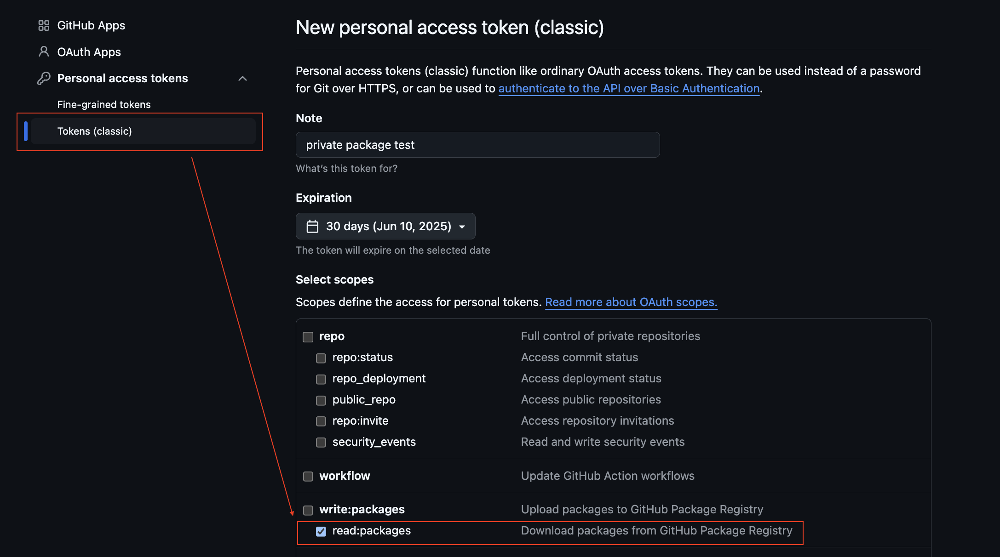

# 긴급정보 서비스 API (Emergency Info Service API) 🚑🌐

[](https://github.com/semantic-release/semantic-release)

## 개발환경 (Development Environment) 🛠️

```plaintext
"node": ">=20.0.0"
"pnpm": ">=9.0.0"
```

## 배포 (Deployment) 🚀

```plaintext
pnpm i
pnpm lambda:deploy
```

## 리소스 주소 (Resource URLs) 🌍

- **스웨거 UI (Swagger UI)**: [https://1acgaqfa8f.execute-api.ap-northeast-2.amazonaws.com/](https://1acgaqfa8f.execute-api.ap-northeast-2.amazonaws.com/) 📖
- **스웨거 Docs (Swagger Docs)**: [https://1acgaqfa8f.execute-api.ap-northeast-2.amazonaws.com/docs](https://1acgaqfa8f.execute-api.ap-northeast-2.amazonaws.com/docs) 📚

## SDK 사용법

- personal access token 발급

  - read:packages 권한이 있는 토큰을 발급받으세요.
    

- 프로젝트 루트에 `.npmrc` 를 추가하고 발급받은 토큰을 `YOUR_GITHUB_TOKEN` 자리에 붙여넣으세요.

```txt
@julooga:registry=https://npm.pkg.github.com/
//npm.pkg.github.com/:_authToken=YOUR_GITHUB_TOKEN
```

- 아래의 명령어로 디펜던시를 설치하세요.

```sh
pnpm i @julooga/doctor_guide_api_sdk@latest
```

- 아래와 같이 사용하세요.

```ts
import { Api } from '@julooga/doctor_guide_api_sdk'

const api = new Api({
  baseURL: 'https://1acgaqfa8f.execute-api.ap-northeast-2.amazonaws.com'
})
const result = await api.hospital.getHospital({ limit: 1 })
console.log(result.data)
/**
{
  success: true,
  data: {
    list: [
      [Object ...]
    ],
    cursor: "eyJJTlNUX0lEIjoiQTIxMDc3NzgifQ",
  },
}
 */
```

## 사용한 AWS 리소스 (AWS Resources Used) ☁️

- **DynamoDB** 🗄️
  - Hospital-safetydata: `arn:aws:dynamodb:ap-northeast-2:166287530750:table/Hospital-safetydata`
  - Pharamacy-safetydata: `arn:aws:dynamodb:ap-northeast-2:166287530750:table/Pharamacy-safetydata`
- **Lambda** 🖥️: `arn:aws:lambda:ap-northeast-2:166287530750:function:doctor_guide_api`
- **API Gateway** 🌐
  - `/`: `arn:aws:apigateway:ap-northeast-2::/apis/1acgaqfa8f/routes/1gqsibp`
  - `/docs`: `arn:aws:apigateway:ap-northeast-2::/apis/1acgaqfa8f/routes/u42m1ya`
